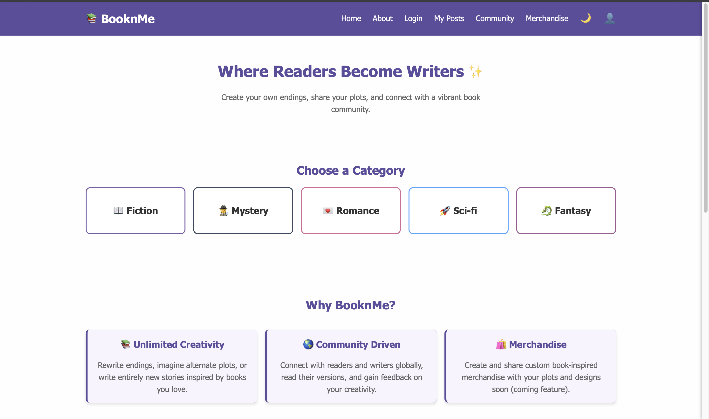
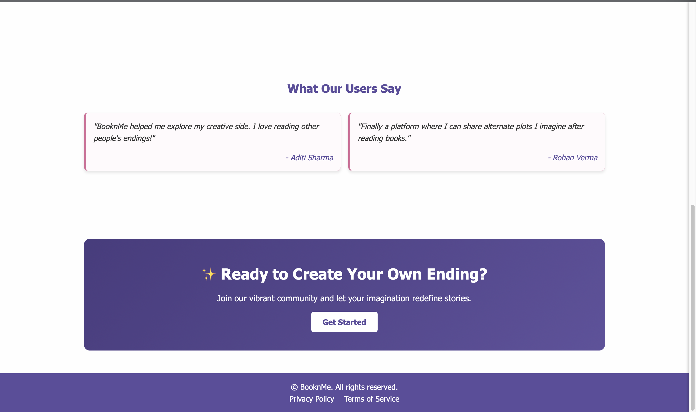
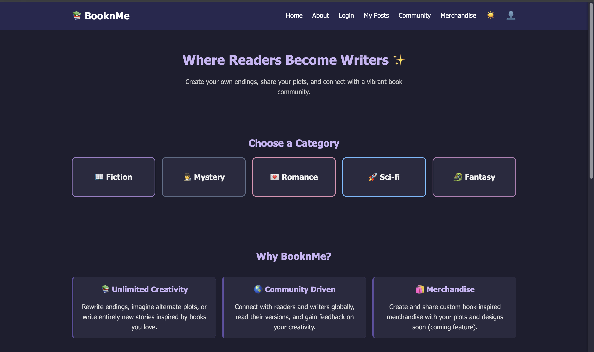
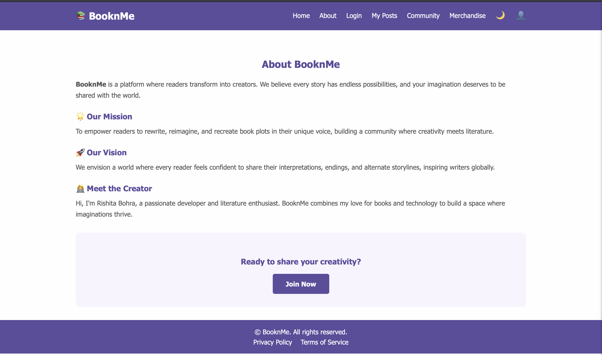
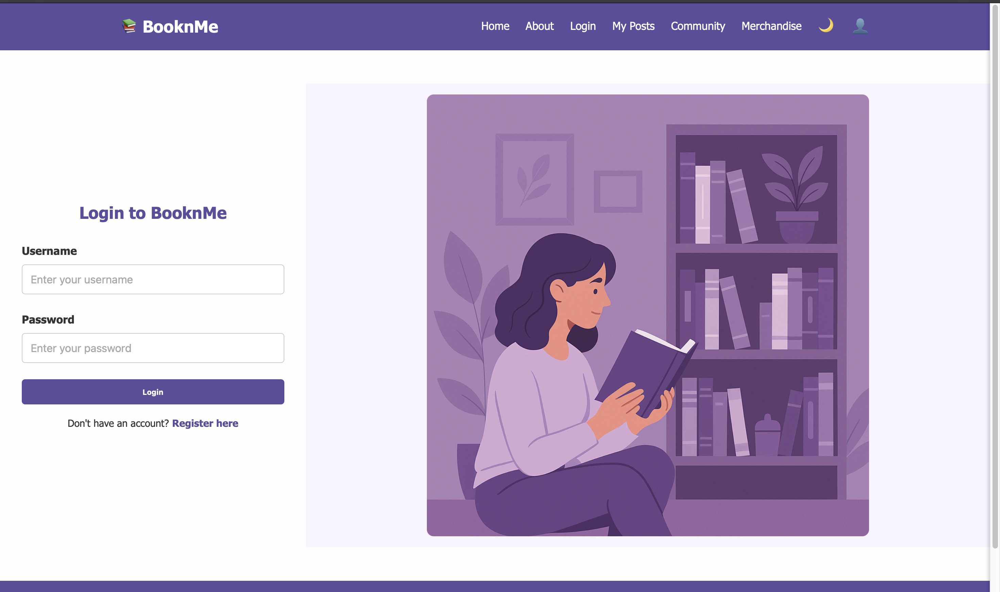
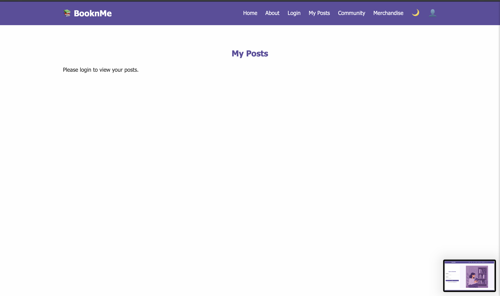
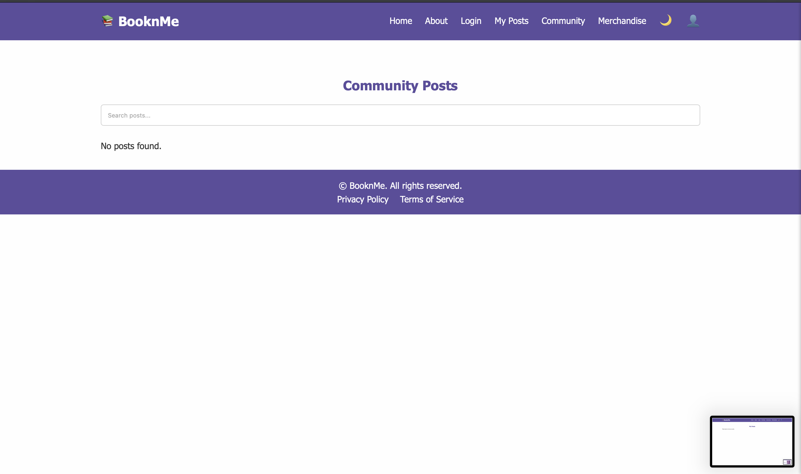
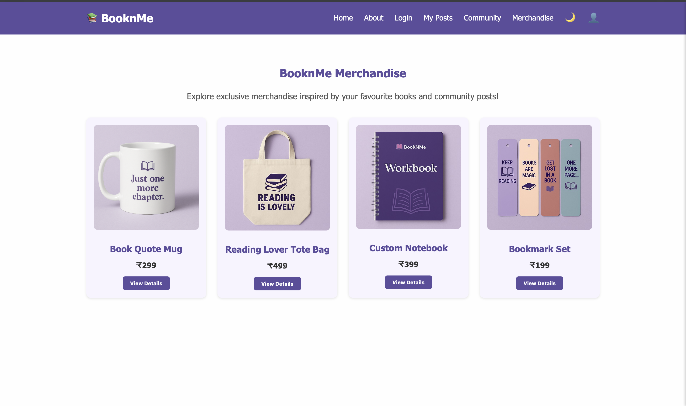

# 📚 BooknMe

BooknMe is a simple and stylish book sharing and community web app that allows users to register, log in, create posts, and engage with other book lovers. It features light/dark themes, account management, and more – all with a clean frontend UI.

---

## 🌟 Features

- ✅ User Registration and Login (Local Storage-based)
- 👤 Account Sidebar with User Info and Logout
- 📄 My Posts and Create Post pages
- 🧑‍🤝‍🧑 Community Page
- 🌙 Light/Dark Theme Toggle
- 🧑‍🎨 Avatar Selection (Male/Female)
- 🔐 Data stored via `localStorage` for simplicity (no backend)

---

## 🛠️ Tech Stack

- **HTML5**
- **CSS3**
- **JavaScript (Vanilla JS)**
- LocalStorage for data persistence
- Responsive Design

---
=======
# 📚 BooknMe

BooknMe is a creative web platform where readers become writers.  
It allows users to explore different book genres, share alternate story endings, connect with a vibrant reading community, and browse book-inspired merchandise.

The platform is designed with a clean and modern UI featuring light/dark mode support and multiple interactive pages.

---

# ✨ Features

- 🌙 Light/Dark Mode Toggle
- 📖 Genre-Based Categories
- 👥 Community Posts Section
- 📝 My Posts Page
- 🔐 Login & Registration UI
- 🛍️ Merchandise Showcase
- 🎨 Modern Responsive Design
- ⚡ Smooth Navigation Between Pages

---

# 📸 Screenshots

## 🏠 Home Page



---

## 🌙 Dark Mode


---

## 📖 About Page


---

## 🔐 Login Page


---

## 📝 My Posts Page


---

## 👥 Community Page


---

## 🛍️ Merchandise Page


---

# 🛠️ Tech Stack

- HTML5
- CSS3
- JavaScript
- Local Storage

---

# 📂 Project Structure

```bash
BooknMe/
│
├── images/
│
├── index.html
├── about.html
├── login.html
├── register.html
├── community.html
├── myposts.html
├── merchandise.html
├── post.html
├── navbar.html
├── footer.html
│
├── style.css
└── script.js
```

---

# 🚀 How to Run Locally

## 1️⃣ Clone the Repository

```bash
git clone https://github.com/your-username/booknme.git
```

---

## 2️⃣ Open the Project Folder

Open the folder in:

- VS Code

---

## 3️⃣ Run the Project

### Using Live Server

- Right click `index.html`
- Click `Open with Live Server`

The website will open in your browser.

---

# 🎯 Future Improvements

- Backend Integration
- User Authentication
- Real Database Support
- Post Likes & Comments
- User Profiles
- AI Story Suggestions
- Book Recommendation System

---

# 💡 Inspiration

BooknMe was created to combine creativity, literature, and technology into a single platform where readers can express their imagination through alternate story endings and community-driven storytelling.

---

# 👩‍💻 Creator

## Rishita Bohra

Passionate developer and literature enthusiast building creative platforms through technology.

---

# 📄 License

This project is created for educational and portfolio purposes.

---

# ⭐ Support

If you like this project:

- Star the repository
- Fork the project
- Share feedback

